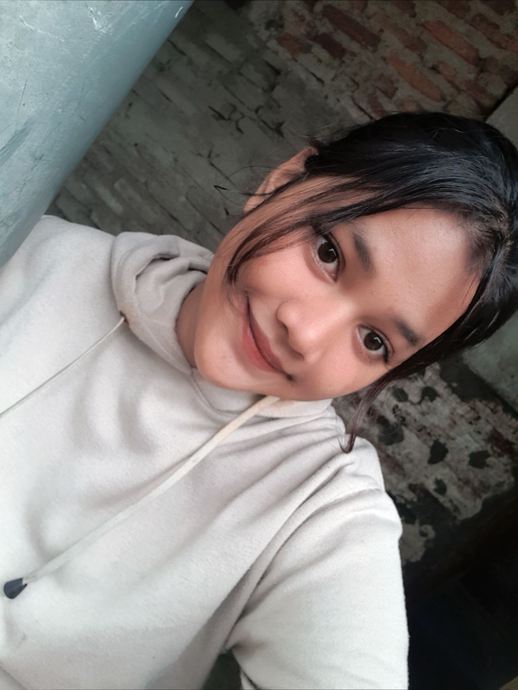

# valentine-surprise
<!DOCTYPE html>
<html lang="id">
<head>
  <meta charset="UTF-8" />
  <meta name="viewport" content="width=device-width, initial-scale=1.0" />
  <title>Valentine Surprise ❤️</title>
  
</head>
<body>

  <!-- Slide 1 -->
  

    
❤️

    <h1>Hai Sayang 💕</h1>
    
Mau gak jadi Valentine aku hari ini?

    <button class="yes" onclick="nextSlide()">YES 😍</button>
    <button class="no" id="noBtn">NO 🙃</button>
  

  <!-- Slide 2 -->
    <!-- Slide 2 -->
  

    
💖

    <h1>Happy Valentine</h1>
    
Hai Nadiaaaa Sayang 🤍

    
    

    

      Aku tau aku kadang ngeselin,
      suka bikin kamu kesel,
      kadang juga kurang peka 😅
    

    

      Maafin aku ya sayang…
      bukan karena aku nggak peduli,
      tapi karena aku masih belajar
      jadi pasangan yang lebih baik buat kamu.
    

    

      Tapi satu hal yang pasti,
      aku beneran sayang kamu 💕
      dari senyum kamu,
      dari juteknya kamu,
      bahkan dari diemnya kamu juga 😆
    

    
Happy Valentine ya sayang ❤️

    
- Dari aku yang selalu pilih kamu

  

    <h1>Happy Valentine</h1>
    
Hai [Nama Pacar],

    

      Makasih ya sudah memilih <b>YES</b> 🤍
      Website kecil ini aku buat khusus buat kamu.
      Kamu itu penting banget buat aku,
      lebih dari yang bisa aku jelasin dengan kata-kata.
    

    
- Dari aku yang sayang kamu

  

  

</body>
</html>
